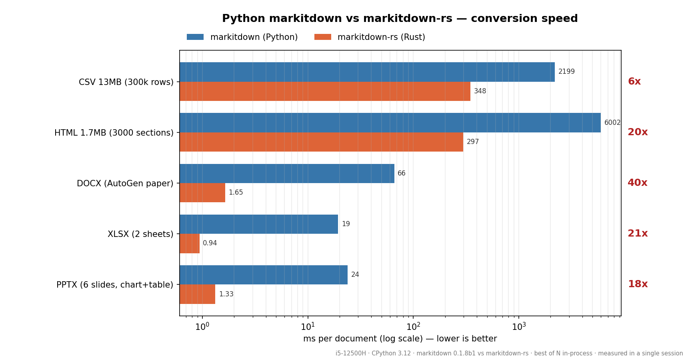

# markitdown-rs

[](LICENSE)
[](https://doc.rust-lang.org/cargo/reference/spec.html)
[](https://github.com/Eswar809/markitdown-rs/releases)
[](#performance)

Converts documents — DOCX, XLSX, PPTX, PDF, HTML, CSV — to Markdown at native Rust speed,
with byte-identical output to the Python original where the format is fully ported.

## What is this?

`markitdown-rs` is a Rust port of [microsoft/markitdown](https://github.com/microsoft/markitdown),
the document-to-Markdown converter used to prepare files for LLM and RAG pipelines. It
reproduces the upstream converters' output on the formats it supports and runs 6–40x
faster by parsing document formats directly instead of routing through Python libraries.
It is a plain Rust library with no Python dependency.

## Highlights

- **Byte-identical output** to Python markitdown, verified by a 54-case differential
  parity suite ([parity.py](parity.py)) plus 25 in-crate unit tests.
- **6–40x faster** than Python markitdown on equivalent documents (see
  [Performance](#performance)).
- **DOCX with equations**: OMML math is converted to LaTeX (`$...$` / `$$...$$`), and
  all four upstream sample documents convert byte-identically.
- **PPTX with charts and groups**: slide comments, position-based shape ordering,
  Python-float chart tables (`2000.0`), and speaker notes.
- **Faithful semantics**: pandas column naming (`Unnamed: N`, `.N` dedup), markdownify
  whitespace/escape rules, `javascript:` link removal, autolinks, colspan tables.
- **Extensible**: register custom converters through the
  [`DocumentConverter`](#usage) trait with the same priority model as upstream.
- **No Python required**: the only dependencies are `csv`, `zip`, `roxmltree`, and
  `pdf-extract`.

## Performance

Lower is better. All rows were measured back-to-back in a single session.

| Document | markitdown (Python) | markitdown-rs (Rust) | Speedup |
|---|---:|---:|---:|
| CSV 13MB (300k rows) | 2199 ms | 348 ms | 6x |
| HTML 1.7MB (3000 sections) | 6002 ms | 297 ms | 20x |
| DOCX (AutoGen paper) | 66 ms | 1.65 ms | 40x |
| XLSX (2 sheets) | 19 ms | 0.94 ms | 21x |
| PPTX (6 slides, chart+table) | 24 ms | 1.33 ms | 18x |

Methodology: i5-12500H, CPython 3.12, markitdown 0.1.8b1 vs markitdown-rs 0.6.0,
best-of-N in-process runs, single session. Reproduce:

```bash
python plot_bench.py
```



## Installation

The crate is not yet published to crates.io. Install from source:

```bash
git clone https://github.com/Eswar809/markitdown-rs.git
cd markitdown-rs
cargo build --release
```

Or depend on it directly from a Git repository:

```bash
cargo add markitdown-rs --git https://github.com/Eswar809/markitdown-rs
```

Requires Rust 1.75 or newer (`rust-version = "1.75"` in Cargo.toml).

## Quickstart

Convert a file with the debug CLI:

```bash
cargo run --release --example dump -- report.docx .docx utf-8
```

Convert in Rust:

```rust
use markitdown_rs::MarkItDown;

let result = MarkItDown::new().convert_local("report.docx")?;
println!("{}", result.markdown);
```

## Usage

### Supported conversions

| Input | Output | Converter | Parity |
|---|---|---|---|
| `.csv` | Markdown table | `CsvConverter` | byte-identical |
| `.html`, `.htm` | Markdown | `HtmlConverter` | byte-identical |
| `.docx` | Markdown, OMML math as LaTeX | `DocxConverter` | byte-identical |
| `.xlsx` | Markdown tables per sheet | `XlsxConverter` | byte-identical |
| `.pptx` | Markdown per slide | `PptxConverter` | byte-identical |
| `.pdf` | Extracted text | `PdfConverter` | assertion-level |
| `.txt`, `.md`, `.json`, ... | Passthrough | `PlainTextConverter` | byte-identical |

PDF parity is assertion-level, not byte-level: upstream uses pdfminer.six, this port
uses the `pdf-extract` crate, so layout spacing can differ. Comparison follows the
upstream test style (per-line rstrip, ±2 line tolerance). Details in
[pdf_spec.md](pdf_spec.md).

### CLI (debug helper)

`examples/dump.rs` converts a single file through the full converter chain:

| Argument | Required | Meaning |
|---|---|---|
| `file` | yes | Path to the input document |
| `extension` | yes | Extension hint used for converter routing (e.g. `.docx`) |
| `charset` | no | Text charset, defaults to `utf-8` |

### Library API

Register a custom converter with the upstream priority model
(lower values are tried first; ties favor later registrations):

```rust
use markitdown_rs::{DocumentConverter, MarkItDown, PRIORITY_SPECIFIC_FILE_FORMAT};

let mut md = MarkItDown::new();
md.register(
    PRIORITY_SPECIFIC_FILE_FORMAT,
    Box::new(my_crate::MyCustomConverter),
);
```

Other public entry points: `convert_stream` (bytes + `StreamInfo` guesses),
`convert_stream_cursor` (zero-copy over an existing cursor), and
`DocumentConverterResult { title, markdown }`. Custom converters implement
`DocumentConverter::name/accepts/convert` over a `Cursor<Vec<u8>>`.

## vs Python markitdown

markitdown-rs produces the same Markdown as Python markitdown on every document in the
parity suite, including edge cases such as pandas `Unnamed: N` column naming, markdownify
escape rules, `javascript:` link removal, data-URI truncation, and OMML-to-LaTeX
conversion. It is 6–40x faster because each format is parsed natively instead of through
Python document libraries. Formats where the two intentionally differ are listed in the
README sections for each converter; PDF is the main gap (see
[pdf_spec.md](pdf_spec.md)). See [Performance](#performance) for measured numbers.

## Feature flags

None. All supported formats are enabled by default.

## Contributing

```bash
cargo fmt
cargo clippy -- -D warnings
cargo test
python parity.py ../markitdown   # requires the upstream repo cloned next to this one
```

Please keep `parity.py` green before submitting a converter change: byte-identical
output is the project's core guarantee.

## License

MIT. See [LICENSE](LICENSE). A port of the MIT-licensed
[microsoft/markitdown](https://github.com/microsoft/markitdown); conversion semantics
and design credit belong to the upstream project and the `markdownify` library. Not
affiliated with Microsoft.

## Roadmap

- [ ] XLSX date/number-format handling (dates currently render as raw serials)
- [ ] PPTX chart types beyond the common set (`[unsupported chart]` fallback)
- [ ] PDF: port the pdfplumber word-geometry table heuristic
- [ ] PDF: byte-level parity via a full pdfminer LAParams port
- [ ] MCP server (`markitdown-mcp` equivalent)

## Acknowledgements

- [microsoft/markitdown](https://github.com/microsoft/markitdown) — design and
  conversion semantics.
- [markdownify](https://github.com/matthewwithanm/python-markdownify) — the HTML to
  Markdown rules ported into `markdownify.rs`.
- [dwml](https://github.com/xiilei/dwml) — the OMML to LaTeX logic adapted by upstream's
  `math/omml.py`, ported here as `docx_math.rs`.
